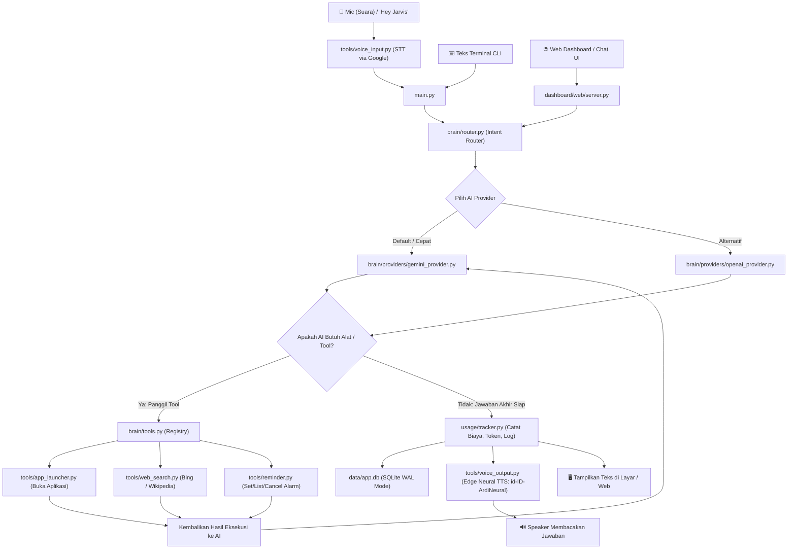

# 🤖 PANDUAN LENGKAP & CARA KERJA SISTEM JARVIS AI

Dokumentasi ini menjelaskan secara mendalam bagaimana arsitektur JARVIS bekerja dari hulu ke hilir, fungsi setiap modul, serta panduan langkah-demi-langkah (tutorial) untuk memasang dan menjalankan program ini di komputer/laptop lain.

---

## 📑 DAFTAR ISI
1. [Pengenalan Singkat](#1-pengenalan-singkat)
2. [Arsitektur & Cara Kerja Program](#2-arsitektur--cara-kerja-program)
   - [Diagram Alur Kerja (Flowchart)](#diagram-alur-kerja)
   - [Penjelasan 5 Tahap Pemrosesan](#penjelasan-5-tahap-pemrosesan)
3. [Struktur Folder & Penjelasan Setiap File](#3-struktur-folder--penjelasan-setiap-file)
4. [Tutorial: Pindah & Jalankan di Komputer Lain](#4-tutorial-pindah--jalankan-di-komputer-lain)
   - [Persyaratan Sistem (Prerequisites)](#persyaratan-sistem)
   - [Langkah 1: Salin File Proyek](#langkah-1-salin-file-proyek)
   - [Langkah 2: Buat & Aktifkan Virtual Environment](#langkah-2-buat--aktifkan-virtual-environment)
   - [Langkah 3: Install Dependensi](#langkah-3-install-dependensi)
   - [Langkah 4: Konfigurasi File .env](#langkah-4-konfigurasi-file-env)
   - [Langkah 5: Cara Menjalankan (Pilih Mode)](#langkah-5-cara-menjalankan-pilih-mode)
5. [Daftar Perintah & Mode Operasional](#5-daftar-perintah--mode-operasional)
6. [Troubleshooting & Solusi Masalah Umum](#6-troubleshooting--solusi-masalah-umum)

---

## 1. PENGENALAN SINGKAT

**JARVIS** adalah asisten AI desktop pintar berbasis Python yang dirancang untuk beroperasi di sistem operasi Windows. Asisten ini menggabungkan:
- **Speech-to-Text & Wake Word:** Mendeteksi panggilan suara *"Hey Jarvis"* tanpa perlu menekan tombol.
- **Dua Otak AI (Multi-Provider Router):** Mendukung Google Gemini (`gemini-3.1-flash-lite`) dan OpenAI (`gpt-4o-mini`) dengan fitur auto-fallback dan estimasi biaya per request.
- **Eksekutor Alat Otomatis (Function Calling):** Mampu membuka aplikasi lokal/PWA/UWP (Spotify, CapCut, Kalkulator, dll.), mencari informasi web secara multi-engine (Bing + Wikipedia), dan mengelola jadwal pengingat.
- **Sistem Pengingat Mandiri (Persistent Reminders):** Tersimpan di SQLite dan tetap berdering walau program sempat ditutup.
- **Dual Dashboard:** Dashboard terminal interaktif (Rich CLI) dan Web Dashboard modern bernuansa *Cybernetic Glassmorphism*.

---

## 2. ARSITEKTUR & CARA KERJA PROGRAM

### Diagram Alur Kerja



### Penjelasan 5 Tahap Pemrosesan

#### 1. Tahap Input (Suara / Teks)
- **Mode Suara (`tools/voice_input.py`):**
  - Menggunakan modul `sounddevice` dan `SpeechRecognition`.
  - Fungsi `get_best_microphone()` memindai perangkat input fisik asli pada Windows dan mengabaikan perangkat virtual (seperti mikrofon OBS, Iriun, atau DroidCam yang kosong).
  - Algoritma mendengarkan kata pemicu *"Hey Jarvis"* atau *"Jarvis"*. Begitu terdeteksi, sistem memutar nada respons dan merekam perintah pengguna sampai hening (Voice Activity Detection).
  - Terdapat mekanisme proteksi `is_speaking()` agar suara dari speaker komputer tidak memicu mikrofon sendiri (mencegah loop feedback/echo).
- **Mode Teks:** Pengguna bisa langsung mengetik via terminal CLI atau kolom chat di Web Dashboard.

#### 2. Tahap Otak AI & Routing (`brain/router.py`)
- Perintah pengguna dikirim ke `IntentRouter`.
- Router menyisipkan **System Prompt** dari `system_prompt.txt` yang mengatur kepribadian JARVIS (bahasa Indonesia formal, solutif, ringkas, dan cerdas).
- Router memuat riwayat percakapan sebelumnya dari `data/conversation_history.json` sehingga JARVIS memiliki memori konteks percakapan.
- Router mengirimkan daftar tool yang tersedia ke model AI.

#### 3. Tahap Function Calling & Eksekusi Alat (`brain/tools.py` & `tools/`)
Jika pertanyaan pengguna memerlukan tindakan di komputer, LLM tidak langsung menjawab teks, melainkan mengirim instruksi *function call*:
- **Buka Aplikasi (`tools/app_launcher.py`):**
  - Memindai Registry Windows, Start Menu Shortcuts, dan perintah PowerShell `Get-StartApps`.
  - Mendukung aplikasi web PWA seperti **Spotify** (dengan menjaga parameter `--app-id` dari file `.lnk`).
  - Mendukung aplikasi Windows Store UWP via `shell:AppsFolder\<AppID>`.
- **Pencarian Web (`tools/web_search.py`):**
  - Menggunakan Bing Search dan Wikipedia API bahasa Indonesia. Jika salah satu terhalang, sistem otomatis beralih ke mesin pencari cadangan.
- **Pengingat / Alarm (`tools/reminder.py`):**
  - Perintah seperti *"ingatkan saya 10 menit lagi untuk minum obat"* diproses dan disimpan ke tabel `reminders` di SQLite.
  - Sebuah thread latar belakang (*daemon*) selalu memeriksa detik demi detik apakah ada jadwal yang jatuh tempo. Jika ada, notifikasi Windows dan suara alarm langsung aktif.

#### 4. Tahap Sintesis Suara (`tools/voice_output.py`)
- Jawaban akhir dari AI dibersihkan terlebih dahulu dari simbol markdown (seperti tanda `*`, `#`, URL, code blocks) menggunakan regex agar terdengar alami saat diucapkan.
- Dikonversi menjadi suara manusia neural bahasa Indonesia berkualitas tinggi menggunakan **Microsoft Edge TTS** (`id-ID-ArdiNeural`).
- File audio sementara disimpan di direktori temp Windows dan diputar langsung melalui pustaka `winmm.dll`.
- Jika koneksi internet putus, tersedia fallback suara offline menggunakan `pyttsx3`.

#### 5. Tahap Logging & Analitik (`usage/tracker.py`)
- Setiap interaksi dicatat ke database SQLite `data/app.db` dengan mode performa tinggi (**WAL - Write-Ahead Logging**).
- Data yang dicatat meliputi: waktu, penyedia AI (Gemini/OpenAI), model, jumlah token input/output, latensi milidetik, perkiraan biaya (USD), intent, nama tool yang dipanggil, serta status berhasil/gagal.
- Data ini dibaca secara real-time oleh Terminal Dashboard dan Web Dashboard.

---

## 3. STRUKTUR FOLDER & PENJELASAN SETIAP FILE

```text
JARVIS/
├── brain/                         # Modul kecerdasan buatan & routing
│   ├── providers/
│   │   ├── gemini_provider.py    # Handler Google GenAI (gemini-3.1-flash-lite)
│   │   └── openai_provider.py    # Handler OpenAI (gpt-4o-mini)
│   ├── router.py                  # Penghubung pesan pengguna, provider & eksekusi tools
│   └── tools.py                   # Pendaftaran skema tools yang dikenali oleh AI
│
├── tools/                         # Kemampuan fungsional yang bisa dijalankan JARVIS
│   ├── app_launcher.py            # Pencari & peluncur aplikasi Windows (Win32 + PWA + Store)
│   ├── reminder.py                # Database pengingat & background scheduler
│   ├── voice_input.py             # Perekaman suara mic & deteksi wake-word
│   ├── voice_output.py            # Konversi teks ke suara (Edge Neural TTS + WinMM)
│   └── web_search.py              # Mesin pencari internet multi-engine (Bing + Wikipedia)
│
├── dashboard/                     # Antarmuka monitoring dan kontrol
│   ├── terminal_dashboard.py      # Dashboard CLI berbasis Rich
│   └── web/
│       ├── server.py              # HTTP Server & REST API endpoint
│       └── static/
│           └── index.html         # Frontend Web Cybernetic Glassmorphism
│
├── usage/
│   └── tracker.py                 # Pelacak token, estimasi biaya, dan riwayat aktivitas
│
├── memory/
│   └── manager.py                 # Pengelola penyimpanan memori percakapan
│
├── data/                          # Folder penyimpanan data lokal
│   ├── app.db                     # Database SQLite (tabel: usage_log, reminders, dll)
│   └── conversation_history.json  # Memori riwayat percakapan sebelumnya
│
├── .env                           # File rahasia berisi API KEY (jangan di-share)
├── .env.example                   # Contoh format file konfigurasi
├── requirements.txt               # Daftar pustaka Python yang wajib diinstall
├── config.py                      # Konfigurasi konstanta global
├── pricing.json                   # Tabel tarif harga token model AI
├── system_prompt.txt              # Kepribadian & instruksi dasar JARVIS
├── tray.py                        # Ikon System Tray Windows (pojok kanan bawah taskbar)
└── main.py                        # Titik masuk utama program (Entry Point)
```

---

## 4. TUTORIAL: PINDAH & JALANKAN DI KOMPUTER LAIN

Ikuti panduan berikut ini jika Anda ingin memindahkan proyek JARVIS ke laptop atau PC lain:

### Persyaratan Sistem
1. **Sistem Operasi:** Windows 10 atau Windows 11 (64-bit).
2. **Python:** Versi **3.10**, **3.11**, atau **3.12** terinstal. Pastikan opsi **"Add python.exe to PATH"** dicentang saat instalasi Python.
3. **Perangkat Keras:** Microphone dan Speaker aktif.
4. **Koneksi Internet:** Diperlukan untuk mengakses API Gemini/OpenAI, Edge TTS, dan pencarian web.

---

### Langkah 1: Salin File Proyek
Salin seluruh folder `JARVIS` ke komputer tujuan (misal diletakkan di `D:\JARVIS` atau `C:\Projects\JARVIS`).

> [!TIP]
> Folder yang tidak perlu disalin (boleh dihapus agar ukuran copy lebih kecil):
> - `__pycache__` (folder cache Python)
> - `venv` / `.venv` (jika ada)

---

### Langkah 2: Buat & Aktifkan Virtual Environment
Buka **PowerShell** atau **Command Prompt**, lalu masuk ke direktori proyek:

```powershell
cd "D:\Path\Ke\Folder\JARVIS"
```

Buat virtual environment baru agar dependensi tidak berbenturan dengan sistem utama:

```powershell
python -m venv venv
```

Aktifkan virtual environment:
- **Di PowerShell:**
  ```powershell
  .\venv\Scripts\Activate.ps1
  ```
  *(Jika muncul error script execution policy di PowerShell, jalankan sekali: `Set-ExecutionPolicy -Scope Process -ExecutionPolicy Bypass` lalu ulangi perintah aktivasi).*
- **Di Command Prompt (cmd.exe):**
  ```cmd
  venv\Scripts\activate.bat
  ```

Tanda berhasil: Nama `(venv)` akan muncul di sebelah kiri baris perintah terminal Anda.

---

### Langkah 3: Install Dependensi
Jalankan perintah ini di dalam terminal yang sudah aktif `venv`:

```powershell
pip install --upgrade pip
pip install -r requirements.txt
```

Pustaka yang akan diinstal meliputi:
- `google-genai` (SDK resmi Google Gemini)
- `openai` (Klien OpenAI)
- `edge-tts` (Sintesis suara neural Microsoft)
- `sounddevice`, `numpy`, `SpeechRecognition` (Pengolahan audio mic)
- `rich` (Tampilan visual terminal berwarna)
- `rapidfuzz`, `pywin32` (Integrasi aplikasi Windows & pencocokan nama pintar)
- `requests`, `beautifulsoup4` (Pencarian web)
- `pystray`, `pillow` (Ikon System Tray Windows)

---

### Langkah 4: Konfigurasi File `.env`
1. Di folder proyek, buat salinan dari `.env.example` dan beri nama file tersebut `.env`:
   ```powershell
   copy .env.example .env
   ```
2. Buka file `.env` menggunakan Notepad atau VS Code.
3. Masukkan API Key Anda:
   ```ini
   # API Keys
   GEMINI_API_KEY=AIzaSyBxxxxxxxxxxxxxxxxxxxxxxxxxx
   OPENAI_API_KEY=sk-proj-xxxxxxxxxxxxxxxxxxxxxxxxx

   # Pilihan provider default saat start: 'gemini' atau 'openai'
   ACTIVE_PROVIDER=gemini

   # Batas anggaran bulanan (dalam USD) & batas peringatan
   MONTHLY_BUDGET=5.0
   BUDGET_ALERT_THRESHOLD=0.8
   ```

> [!NOTE]
> **Cara Mendapatkan Gemini API Key Gratis:**
> 1. Buka [Google AI Studio](https://aistudio.google.com/).
> 2. Login menggunakan akun Google.
> 3. Klik tombol **"Get API key"** -> **"Create API key"**.
> 4. Salin kuncinya dan tempel ke `GEMINI_API_KEY=` di file `.env`. *(Model `gemini-3.1-flash-lite` memiliki kuota gratis yang sangat leluasa).*

---

### Langkah 5: Cara Menjalankan (Pilih Mode)

Anda dapat memilih cara menjalankan JARVIS sesuai kebutuhan:

#### Pilihan A: Mode Web Dashboard Interaktif (Sangat Direkomendasikan)
Menjalankan server web lokal dan langsung membuka browser otomatis dengan tampilan futuristik:
```powershell
python main.py web
```
*Akses manual dari browser: `http://127.0.0.1:5050`*

#### Pilihan B: Mode Suara Wake Word ("Hey Jarvis")
Mode asisten suara pasif yang menunggu panggilan Anda di ruangan:
```powershell
python main.py wake
```
*Katakan "Hey Jarvis, buka Spotify" atau "Hey Jarvis, ingatkan saya 5 menit lagi".*

#### Pilihan C: Mode Teks Interaktif (Terminal Chat)
Jika Anda sedang tidak ingin berbicara atau berada di tempat bising:
```powershell
python main.py text
```

#### Pilihan D: Mode System Tray (Latar Belakang Windows)
Menjalankan JARVIS di pojok kanan bawah taskbar Windows (dekat jam):
```powershell
python main.py tray
```
*Klik kanan ikon tray untuk membuka Web Dashboard, melihat statistik, atau mematikan aplikasi.*

#### Pilihan E: Dashboard Statistik Terminal
Untuk melihat metrik biaya, sisa kuota, dan log aktivitas langsung di terminal:
```powershell
python main.py dashboard
```

---

## 5. DAFTAR PERINTAH & FITUR UNGGULAN

| Perintah Suara / Teks | Hasil / Tindakan |
| :--- | :--- |
| *"Buka Spotify"* / *"Buka CapCut"* | Meluncurkan aplikasi desktop atau PWA terkait secara instan |
| *"Buka kalkulator"* / *"Buka kamera"* | Membuka aplikasi Windows Store / UWP |
| *"Cari berita terbaru tentang teknologi AI hari ini"* | Melakukan web search via Bing & Wikipedia dan merangkum hasilnya |
| *"Ingatkan saya 15 menit lagi untuk istirahat mata"* | Menjadwalkan pengingat ke database; alarm & suara akan berbunyi saat jatuh tempo |
| *"Apa saja pengingat saya yang aktif?"* | Menampilkan daftar pengingat yang tersimpan di database |
| *"Batalkan pengingat nomor 1"* | Menghapus jadwal pengingat tertentu |
| *"Ganti provider ke openai"* / *"Ganti ke gemini"* | Menukar otak AI secara langsung tanpa perlu restart |
| *"Keluar"* / *"Sampai jumpa"* | Menutup sesi JARVIS |

---

## 6. TROUBLESHOOTING & SOLUSI MASALAH UMUM

### 1. Suara JARVIS masuk kembali ke mikrofon (Feedback Loop)
- **Penyebab:** Volume speaker terlalu keras sehingga mikrofon merekam suara JARVIS saat menjawab.
- **Solusi:** Modul `tools/voice_output.py` sudah dilengkapi flag `is_speaking()` dan jeda debounce 0.8 detik. Namun jika mikrofon Anda sangat sensitif, disarankan mengecilkan volume speaker laptop/headset sedikit atau menurunkan sensitivitas mic di Windows Sound Settings.

### 2. Mikrofon tidak mendeteksi suara sama sekali
- **Penyebab:** Ada aplikasi virtual mic seperti Iriun Webcam, DroidCam, atau OBS Virtual Audio yang dipilih secara default oleh Windows.
- **Solusi:** Program sudah otomatis mencari mikrofon fisik asli. Pastikan izin mikrofon Windows aktif (*Settings > Privacy & Security > Microphone > Allow apps to access your microphone = ON*).

### 3. Error Google GenAI `503 Service Unavailable` atau `Rate Limit`
- **Penyebab:** Model `gemini-3.8-flash` sering mengalami lonjakan trafik dari Google.
- **Solusi:** Proyek ini sudah dikonfigurasi menggunakan `gemini-3.1-flash-lite` yang jauh lebih stabil, bebas kuota limit, dan sangat responsif.

### 4. PWA / Spotify tidak terbuka
- **Penyebab:** File shortcut target mengarah ke `chrome_proxy.exe` tanpa parameter ID.
- **Solusi:** Modul `tools/app_launcher.py` sudah diperbarui untuk meluncurkan shortcut `.lnk` utuh via Windows ShellExecute sehingga Spotify dan semua Chrome App terbuka normal.

### 5. Karakter teks rusak di Command Prompt Windows bawaan
- **Penyebab:** Default encoding Windows cmd.exe menggunakan `cp1252` bukan UTF-8.
- **Solusi:** Gunakan **Windows Terminal** atau PowerShell modern. Seluruh skrip Python JARVIS juga sudah dipasangi `sys.stdout.reconfigure(encoding="utf-8")` untuk mencegah crash.

---

*Dibuat untuk mempermudah pemahaman arsitektur JARVIS AI dan migrasi instalasi antar perangkat.*
